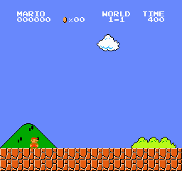
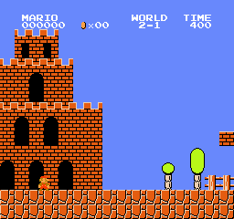
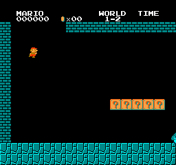
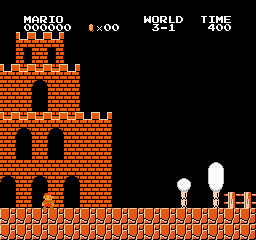
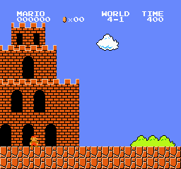

# MarioAI 🍄 - PPO Agent That Plays Super Mario Bros From Raw Pixels

A deep reinforcement learning agent that learns to play **Super Mario Bros** directly from raw game frames - no access to the game's internal state, just pixels in and button presses out, exactly like a human looking at the screen.

Built on **PPO** (Proximal Policy Optimization) and the `gym-super-mario-bros` NES environment.

<p align="center">
  <br>
  <em>The trained agent clearing World 1-1 - learned entirely from raw pixels, <b>100% clear rate</b> over 20 greedy episodes.</em>
</p>

## What's here

This repo is a complete, tested PPO pipeline for Mario:

- **Learning from pixels alone.** The agent never sees Mario's x-position or enemy locations as numbers - it perceives them from an 84x84 grayscale image, like the classic DeepMind Atari work. A convolutional network does the seeing.
- **A multi-task training pipeline.** `train.py` trains one network across a *set* of levels at once (a worker per level in a `SubprocVecEnv`), so a single model can learn many levels - and an `evaluate.py` that measures per-level clear-rate for a held-out **zero-shot** generalization test.
- **Smooth GIF recording.** `record_gif.py` plays N rollouts, keeps the cleanest, and captures every native game frame for smooth playback.

## What this build demonstrates

This session trained on an 18 GB laptop (CPU), which bounds what fits in memory. What's shown here:

1. **World 1-1 specialist - solved.** Trained to a **100% clear rate** (20/20 greedy episodes, mean reward 3106). That's the hero GIF above.
2. **Zero-shot generalization of that specialist.** The 1-1 model has only ever seen World 1-1. Below it plays **six levels it has never encountered**. It doesn't clear them - platformer agents famously overfit to the pixels they trained on - but it clearly transfers "run right, jump gaps, stomp enemies," navigating the opening stretch of each unseen level. An honest look at what a single-level agent generalizes.

> **The full multi-task run** (one model trained across all six levels + the designed zero-shot holdout on `1-4`, `5-1`) is fully implemented and runnable - it just needs more RAM than this laptop had (the 8-emulator job was killed by the OS memory manager). Run `python -m marioai.train --config configs/default.yaml --run-name mario_multitask` on a machine with more memory, or use the documented AWS GPU workflow in [`scripts/aws_provision.md`](scripts/aws_provision.md).

## Results

| Model | Level | Seen in training? | Outcome |
|-------|-------|:---:|---------|
| 1-1 specialist | 1-1 | ✅ | **100% clear** (mean reward 3106) |
| 1-1 specialist | 2-1 | ❌ zero-shot | partial - navigates the opening overworld section |
| 1-1 specialist | 1-2 | ❌ zero-shot | partial - runs through the underground start, stomping enemies |
| 1-1 specialist | 3-1 | ❌ zero-shot | partial - clears the first obstacles |
| 1-1 specialist | 4-1 | ❌ zero-shot | partial - handles the opening platforms |

## Gallery

**Trained (World 1-1) - cleared:** see the hero GIF above.

**Zero-shot - the 1-1 model on levels it never trained on:**

| World 2-1 | World 1-2 |
|:---:|:---:|
|  |  |
| **World 3-1** | **World 4-1** |
|  |  |

*These are honest partials: the agent plays smoothly but dies before the flag - it was only ever trained on 1-1.*

## How it works

```
raw NES frame (240x256x3)
  -> grayscale + resize to 84x84
  -> frame-skip 4 (repeat action, sum reward)
  -> stack 4 frames  (so the CNN can perceive velocity from a still image)
  -> PPO CnnPolicy (NatureCNN)  ->  one of 7 SIMPLE_MOVEMENT actions
```

Parallel Mario emulators run in a `SubprocVecEnv`; PPO pools their experience into one shared policy. Reward is the environment's shaped signal (rightward progress, minus a time penalty, minus a death penalty).

## Setup

Requires **Python 3.13** (the modern `gym-super-mario-bros` / `nes-py` are Gymnasium-native and need 3.13+).

```bash
git clone https://github.com/keysmon/MarioAI.git
cd MarioAI
uv venv --python 3.13 .venv && source .venv/bin/activate   # or: python3.13 -m venv .venv
pip install -r requirements.txt
pip install -e .
```

<details>
<summary>Legacy fallback (Python 3.10)</summary>

If you cannot use Python 3.13, an older battle-tested stack is pinned in `requirements-legacy.txt`. It needs a one-time pre-step (the `gym==0.21` setuptools quirk):

```bash
pip install setuptools==65.5.0 wheel==0.38.4
pip install gym==0.21.0
pip install -r requirements-legacy.txt
```
Then switch `import gymnasium as gym` -> `import gym` and the 5-tuple `step`/`reset` to old-gym 4-tuples.
</details>

## Usage

```bash
# Train a single level (this is how the 1-1 specialist above was made):
python -m marioai.train --config configs/default.yaml --levels 1-1 --timesteps 1000000 --run-name mario_1_1

# Train the multi-task model across all default levels (needs more RAM):
python -m marioai.train --config configs/default.yaml --run-name mario_multitask

# Lower memory: fewer parallel emulators
python -m marioai.train --config configs/default.yaml --levels 1-1 --n-envs 4 --run-name mario_1_1

# Evaluate clear-rate + mean reward:
python -m marioai.evaluate --model models/mario_1_1/final.zip --levels 1-1 2-1 1-2

# Record a smooth GIF (records N rollouts, keeps the cleanest):
python -m marioai.record_gif --model models/mario_1_1/final.zip --level 1-1 --out assets/gifs/1-1.gif
```

Training logs to TensorBoard (`tensorboard --logdir runs`). Config (levels, hyperparameters, timesteps) lives in `configs/default.yaml`.

## Project layout

```
src/marioai/
  wrappers.py     frame-skip + grayscale/resize (with smooth-capture mode for GIFs)
  envs.py         env factory + multi-task SubprocVecEnv assembly
  train.py        config-driven PPO training (--levels, --n-envs, --timesteps)
  evaluate.py     per-level clear-rate + mean reward
  record_gif.py   N-rollouts-keep-cleanest native-RGB GIF recorder
configs/          hyperparameters + level sets
scripts/          spike, train, record, AWS runbook
tests/            wrapper unit tests + PPO smoke test
```

## Notes on training & compute

The pipeline runs on CPU or GPU (`device: auto`). Emulators are CPU-bound, so throughput scales with CPU cores; a GPU mainly speeds the policy update. Parallel emulators are memory-hungry - on a RAM-constrained machine, lower `--n-envs` (each emulator is a process). The 1-1 specialist here trained in ~15 minutes on an M3 Pro at 8 envs (~1000 env-steps/sec). `scripts/aws_provision.md` documents an on-demand AWS GPU workflow (quota preflight -> train -> download -> terminate) for the full multi-task run.

## License

MIT - see [LICENSE](LICENSE).
