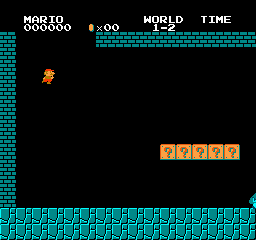
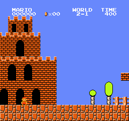
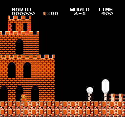
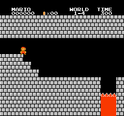
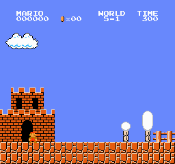

# MarioAI 🍄 - PPO Agent That Plays Super Mario Bros From Raw Pixels

A deep reinforcement learning agent that learns to play **Super Mario Bros** directly from raw game frames - no access to the game's internal state, just pixels in and button presses out, exactly like a human looking at the screen.

**One** PPO network, trained **multi-task** across six levels at once, then tested **zero-shot** on levels it never saw.

<p align="center">
  <br>
  <em>A single multi-task model clearing World 1-1 - learned entirely from raw pixels.</em>
</p>

## The headline result

One shared network was trained across **1-1, 1-2, 1-3, 2-1, 3-1, 4-1** simultaneously (a random level per parallel worker). Greedy evaluation, 20 episodes per level:

| Level | In training? | Clear rate | Mean reward |
|-------|:---:|:---:|---:|
| **1-1** | ✅ | **100%** | 3105 |
| **1-2** (underground) | ✅ | **100%** | 2891 |
| **4-1** | ✅ | **100%** | 3589 |
| 2-1 | ✅ | 0% - gets most of the way | 2616 |
| 3-1 | ✅ | 0% - strong partial | 2549 |
| 1-3 (athletic/pits) | ✅ | 0% | 719 |
| 1-4 | ❌ **zero-shot** | 0% | 171 |
| 5-1 | ❌ **zero-shot** | 0% | 140 |

**A single model clears three of six diverse levels** - overworld (1-1), underground (1-2), and 4-1 - and gets most of the way through 2-1 and 3-1 (reward ~2,600) before dying. The hardest training level (1-3, full of pits) and both **zero-shot** holdout levels are not solved: platformer policies famously overfit to the pixels they trained on, and this is an honest look at exactly that.

## Gallery

**Cleared (one multi-task model):**

| World 1-1 | World 1-2 (underground) | World 4-1 |
|:---:|:---:|:---:|
|  |  |  |

**Nearly cleared (same model, dies just before the flag):**

| World 2-1 | World 3-1 |
|:---:|:---:|
|  |  |

**Zero-shot - levels the model never trained on (honest failure):**

| World 1-4 | World 5-1 |
|:---:|:---:|
|  |  |

## How it works

```
raw NES frame (240x256x3)
  -> grayscale + resize to 84x84
  -> frame-skip 4 (repeat action, sum reward)
  -> stack 4 frames  (so the CNN can perceive velocity from a still image)
  -> PPO CnnPolicy (NatureCNN)  ->  one of 7 SIMPLE_MOVEMENT actions
```

16 Mario emulators run in parallel (`SubprocVecEnv`), each pinned to one of the six training levels (round-robin); PPO pools their experience into one shared policy. Reward is the environment's shaped signal (rightward progress, minus a time penalty, minus a death penalty). The agent never sees Mario's coordinates - only the 84x84 image.

## Setup

Requires **Python 3.13** (the modern `gym-super-mario-bros` / `nes-py` are Gymnasium-native and need 3.13+).

```bash
git clone https://github.com/keysmon/MarioAI.git
cd MarioAI
uv venv --python 3.13 .venv && source .venv/bin/activate   # or: python3.13 -m venv .venv
pip install -r requirements.txt
pip install -e .
```

<details>
<summary>Legacy fallback (Python 3.10)</summary>

If you cannot use Python 3.13, an older battle-tested stack is pinned in `requirements-legacy.txt` (needs a one-time `pip install setuptools==65.5.0 wheel==0.38.4 && pip install gym==0.21.0` first, then `import gymnasium as gym` -> `import gym` and 5-tuple -> 4-tuple `step`/`reset`).
</details>

## Usage

```bash
# Train the multi-task model across all six levels:
python -m marioai.train --config configs/default.yaml --run-name mario_multitask

# Fewer parallel emulators (lower memory):
python -m marioai.train --config configs/default.yaml --run-name mario_multitask --n-envs 8

# Evaluate per-level clear-rate + mean reward:
python -m marioai.evaluate --model models/mario_multitask/final.zip --levels 1-1 1-2 1-3 2-1 3-1 4-1 1-4 5-1

# Record a smooth GIF (records N rollouts, keeps the cleanest):
python -m marioai.record_gif --model models/mario_multitask/final.zip --level 1-1 --out assets/gifs/mt-1-1.gif
```

Training logs to TensorBoard (`tensorboard --logdir runs`). Config (levels, hyperparameters, timesteps) lives in `configs/default.yaml`. The pretrained multi-task model is on the [v0.2.0 Release](https://github.com/keysmon/MarioAI/releases/tag/v0.2.0).

## Notes on compute

This model was trained for **8M steps (~2.5 h)** on an AWS `c7i.4xlarge` (16 vCPU, 32 GB). Mario RL is **CPU-bound** - the bottleneck is stepping the NES emulators, not the small CNN - so throughput scales with CPU cores, and a big-RAM CPU box beats a GPU here (the GPU would sit mostly idle). The pipeline runs anywhere via `device: auto`; on a RAM-constrained machine, lower `--n-envs` (each emulator is a process).

## Project layout

```
src/marioai/
  wrappers.py     frame-skip + grayscale/resize (with smooth-capture mode for GIFs)
  envs.py         env factory + multi-task SubprocVecEnv assembly
  train.py        config-driven PPO training (--levels, --n-envs, --timesteps)
  evaluate.py     per-level clear-rate + mean reward
  record_gif.py   N-rollouts-keep-cleanest native-RGB GIF recorder
configs/          hyperparameters + level sets
scripts/          spike, train, record, AWS runbook
tests/            wrapper unit tests + PPO smoke test
```

## License

MIT - see [LICENSE](LICENSE).
