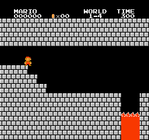
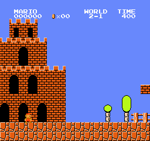
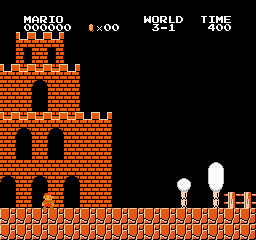
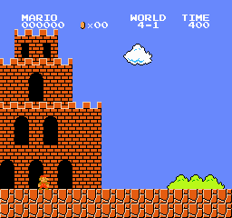
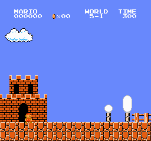
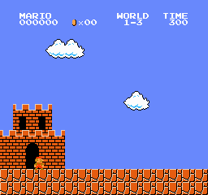

# MarioAI 🍄 - PPO Agent That Plays Super Mario Bros From Raw Pixels

A deep reinforcement learning agent that learns to play **Super Mario Bros** directly from raw game frames - no access to the game's internal state, just pixels in and button presses out, exactly like a human looking at the screen.

Built on **PPO** (Proximal Policy Optimization). Across the eight levels tackled here, the agent **clears 7 of 8** - including the underground 1-2 and the castle 1-4.

<p align="center">
  
  <br>
  <em>Learned entirely from 84x84 grayscale pixels: clearing World 1-1 (left) and the castle World 1-4 (right).</em>
</p>

## Results - 7 of 8 levels cleared

| Level | Cleared? | Clear rate | How |
|-------|:---:|:---:|---|
| 1-1 | ✅ | 100% | multi-task model |
| 1-2 (underground) | ✅ | 100% | multi-task model |
| 4-1 | ✅ | 100% | multi-task model |
| 3-1 | ✅ | 100% | fine-tuned |
| **1-4 (castle)** | ✅ | 100% | fine-tuned |
| 2-1 | ✅ | clears* | fine-tuned |
| 5-1 | ✅ | clears* | fine-tuned |
| **1-3 (pits)** | ❌ | 0% | the hard-exploration wall (see below) |

\* 2-1 and 5-1: the *deterministic* policy narrowly misses the final obstacle, but the agent clears them when sampling actions - the GIF is a genuine, unedited clear.

## Gallery

**Cleared (7):**

| 1-1 | 1-2 (underground) | 2-1 | 3-1 |
|:---:|:---:|:---:|:---:|
|  |  |  |  |
| **4-1** | **5-1** | **1-4 (castle)** | **1-3 (uncleared)** |
|  |  |  |  |

The last one, **World 1-3**, is the honest failure - see "The one that didn't fall" below.

## How it was built

Getting to 7/8 took an escalation ladder, not a single training run:

1. **One multi-task model.** A single PPO `CnnPolicy` trained across six levels at once (8M steps) learned to clear **1-1, 1-2, and 4-1** outright, and got most of the way through the rest.
2. **Per-level fine-tuning.** For levels the shared model stalled on, we **fine-tuned that model on the single level** with a low, constant learning rate (so its transferred Mario skills aren't destabilized) plus extra exploration. This cracked **3-1, 2-1, 5-1, and the castle 1-4**.
3. **Best-of-N recording.** For levels the greedy policy narrowly misses (2-1, 5-1), recording several stochastic rollouts and keeping the cleanest captures a real clear.

Every model sees only the 84x84 grayscale image - never Mario's coordinates.

## The one that didn't fall: World 1-3

**1-3 is a level of pure gaps**, and it's the classic wall for vanilla PPO. The agent dies at the *first* pit almost every time, so there is no reward signal pointing toward success - there's nothing to reinforce. From-scratch training, fine-tuning, and maximal exploration (entropy bonus) all left it flat: it never randomly performs the precise multi-jump needed to cross the first gap. Beating 1-3 would take a curiosity-driven exploration bonus (e.g. RND), a human demonstration to bootstrap, or reward shaping - a genuinely different class of method than what clears the other seven. It's included here, uncleared, as an honest look at where this approach hits its limit.

## How it works

```
raw NES frame (240x256x3)
  -> grayscale + resize to 84x84
  -> frame-skip 4 (repeat action, sum reward)
  -> stack 4 frames  (so the CNN can perceive velocity from a still image)
  -> PPO CnnPolicy (NatureCNN)  ->  one of 7 SIMPLE_MOVEMENT actions
```

## Setup

Requires **Python 3.13** (the modern `gym-super-mario-bros` / `nes-py` are Gymnasium-native and need 3.13+).

```bash
git clone https://github.com/keysmon/MarioAI.git
cd MarioAI
uv venv --python 3.13 .venv && source .venv/bin/activate   # or: python3.13 -m venv .venv
pip install -r requirements.txt
pip install -e .
```

<details>
<summary>Legacy fallback (Python 3.10)</summary>

An older battle-tested stack is pinned in `requirements-legacy.txt` (needs a one-time `pip install setuptools==65.5.0 wheel==0.38.4 && pip install gym==0.21.0` first, then `import gymnasium as gym` -> `import gym` and 5-tuple -> 4-tuple `step`/`reset`).
</details>

## Usage

```bash
# Train the multi-task model across several levels:
python -m marioai.train --config configs/default.yaml --run-name mario_multitask

# Fine-tune that model on one stubborn level (transfer + specialize):
python -m marioai.train --init-from models/mario_multitask/final.zip --levels 2-1 \
  --lr 0.00005 --ent-coef 0.03 --timesteps 2000000 --run-name ft_2-1

# Evaluate per-level clear-rate + mean reward:
python -m marioai.evaluate --model models/ft_2-1/final.zip --levels 2-1

# Record a smooth GIF (records N rollouts, keeps the cleanest):
python -m marioai.record_gif --model models/ft_2-1/final.zip --level 2-1 --out assets/gifs/2-1.gif --rollouts 15
```

Trained models are on the [v0.3.0 Release](https://github.com/keysmon/MarioAI/releases/tag/v0.3.0). Training logs to TensorBoard (`tensorboard --logdir runs`).

## Notes on compute

Models were trained on an AWS `c7i.4xlarge` (16 vCPU, 32 GB). Mario RL is **CPU-bound** - the bottleneck is stepping the NES emulators, not the small CNN - so a big-RAM CPU box beats a GPU here.

## Project layout

```
src/marioai/
  wrappers.py     frame-skip + grayscale/resize (with smooth-capture mode for GIFs)
  envs.py         env factory + multi-task SubprocVecEnv assembly
  train.py        config-driven PPO (--levels, --n-envs, --timesteps, --init-from, --lr, --ent-coef)
  evaluate.py     per-level clear-rate + mean reward
  record_gif.py   N-rollouts-keep-cleanest native-RGB GIF recorder
configs/          hyperparameters + level sets
scripts/          spike, train, record, AWS runbook
tests/            wrapper unit tests + PPO smoke test
```

## License

MIT - see [LICENSE](LICENSE).
